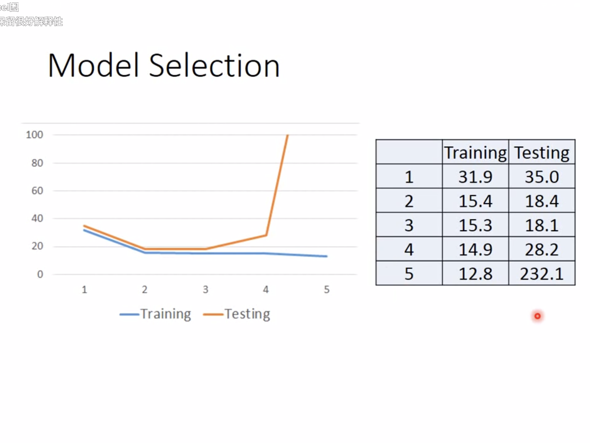
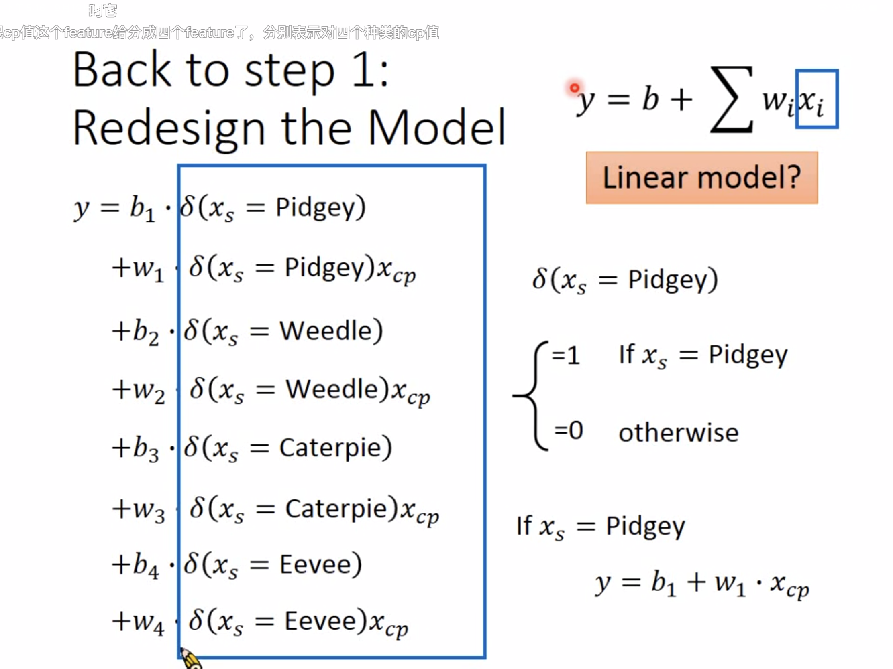
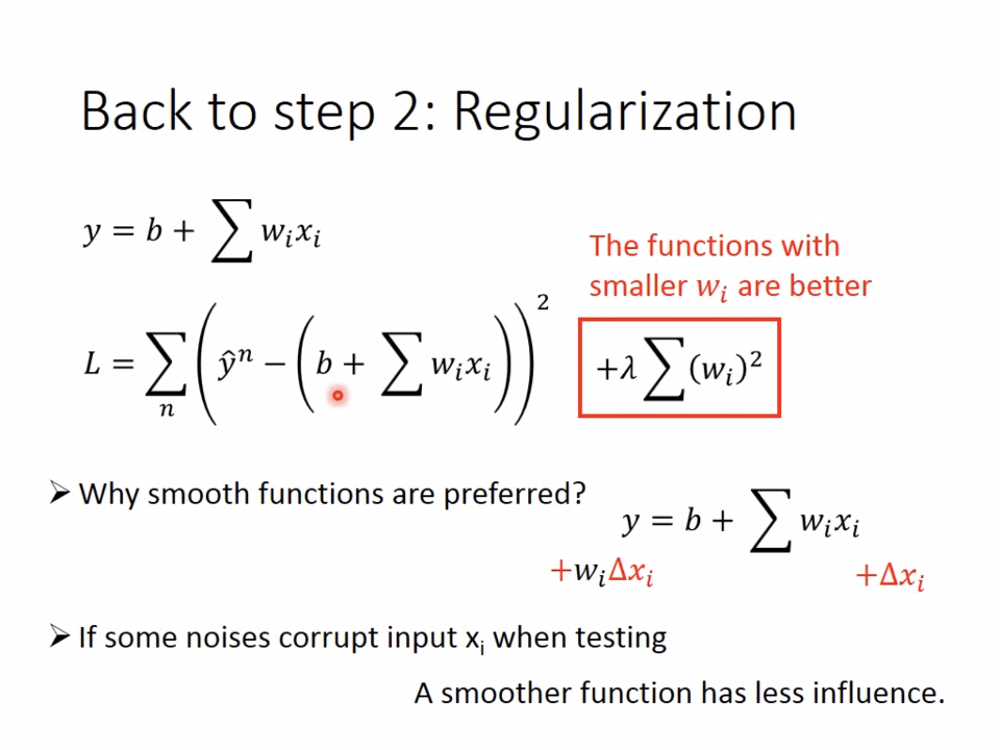

## Regression

* 应用场景多见于预测股票，PM2.5值。
* 以精灵宝可梦为例，来预测精灵进化之后的combat power。

属性有如下几个：\
1. 当前战斗力Xcp
2. Xs: 精灵种类
3. Xhp:血量
4. Xw:重量，Xh:高度

输出是进化后的战斗力。
### Step1: Model
例如:

> $$ Y = b + W*X_{cp} $$
就是一个计算进化之后战斗力的函数式。
更进一步的，如果函数式可以写成
> $$ Y = b+\sum W_i*X_i $$
> $$ Xi是杰尼龟的各种属性,Wi是权重，b是bias$$

### Step2 Goodness of Function
**有一点需要注意的是后期的Y其实是一个向量，输出会有多个值。**\
我们可以画出对应进化之后战斗力和进化之前战斗力的对比。

#### Loss Function
简而言之就是function的function
> $$L(f) = L(w,b)\\=\sum_{n=1}^{10}(\overset{\wedge}y-(b+w\cdot x_{cp}^n))^2  $$
相当于说就是对实际进化之后的战斗力与估计的战斗力差值的平法求和。

### Step 3:Best Function
Pick the "Best" Function\
我们可以通过Gradient Descent（梯度下降）来计算最值。只要是可微分的就可以做。\
假设我们现在先假定只有一个权重W，不计算bias。使用Gradient Descent的做法如下：
* 随机选一个点$W^0$
* 计算出该点的导数，将该点往函数值减小的方向进行移动
* 现在问题来到了，我们每一步应该移动多少呢？
> $$-\eta \frac{dL}{dW}|_{w=w_0}$$
就是上面个值，其中$\eta$叫做学习率，最终得到下一步，即
> $$ W^0 - \eta \frac{dL}{dW}|_{w=w_0} \rightarrow W^1$$
**注意这里w是指横坐标哦，就是指W在水平方向上移动的距离（正负表示方向）**
* 重复值上步骤经过多次更新之后可能会达到一个局部最优解(local optimal),但是有时候局部最优解并不一定是全局最优解(global optimal),但是linear model的情况下是不会出现这种情况的。

同理，当我们回归到两个变量w,b的情况，是这个时候我们只需要分别对w，b求偏导，类似与之前的步骤不断调整这两个参数的值，来得到使LOSS函数最小的参数对。\
再回到前面所说的local optimal不一定是global optimal的问题，因为我们之前所使用到的LOSS函数是convex的，即凸包，所以任意选取一个起始点，最终得到的结果都是一样的。

### Result
最终我们得到的线性模型肯定不能不会经过所有的点，是会存在一些误差的。**一般来说测试集的LOSS会比训练集的LOSS要更大**\
当我们发现线性函数不能较好的估计实际的战斗力情况时，我们可以尝试用二次函数进行模拟。以此类推,可能三次函数或者更高阶的函数的模拟效果会更好。**但是也会出现在训练集上表现效果很好，但是测试集比较差，这就是所谓的过拟合现象，如下图。（Overfitting）**\

### Hidden Factors
当我们采集更多的数据时，会发现输入属性和输出可能不是简单的函数关系（**因为函数有个特点只能一对一的映射**），就精灵宝可梦的来说，不同的物种进化前后的战力对比关系可能差异会比较大，所以我们需要对种类进行分类。
1. 如果是某个种族的精灵我们就考虑某一部分的影响，如果不是，就不考虑这一部分的影响。
2. 有点类似与信号与处理中的函数，信号强度大于一个阈值时输出为1，否则为0.这个就叫作分类器,如下图（似乎得手动分类2333，岂不是分不好就完蛋了）。

3. 似乎分类要从输入的本质去进行一个可解释性的分类...... ，除了比较明显的因素之外，另外好像只能靠猜测了。

但是当函数复杂化的时候，又会出现overfitting的问题。

### Regularization
其实就是在原来的LOSS函数上选取较小的W值，这样会使模拟曲线比较平滑，收到输入变动的影响也更小。注意添加的偏移时是不用考虑的，因为bias和曲线的平滑程度是没有关系的。\

